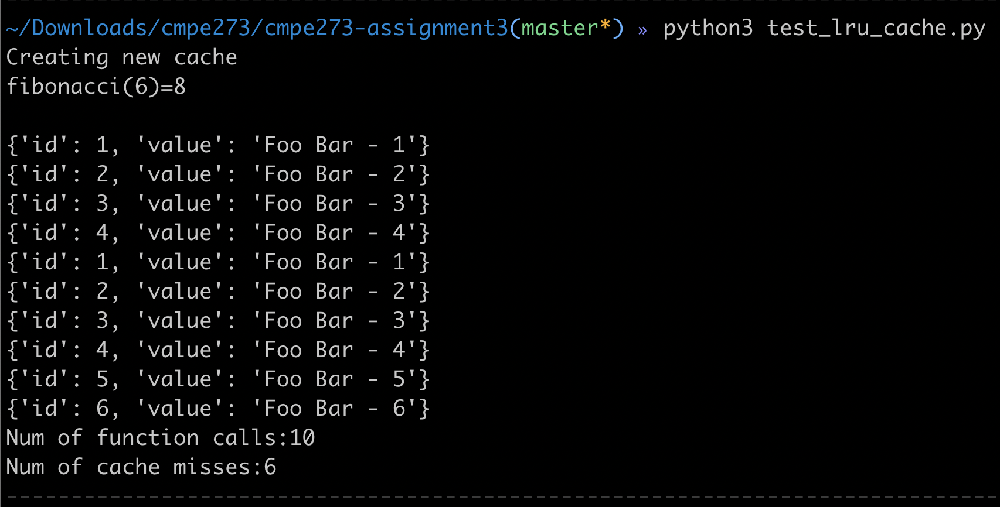
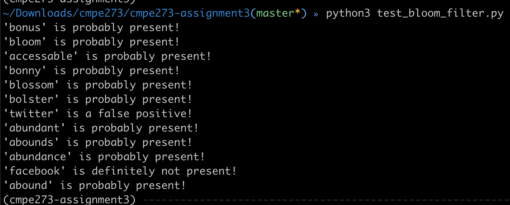

# cmpe273-assignment3

## Implementation of LRU Cache and Bloom Filter

* Output of LRU Cache test case
```
python3 test_lru_cache.py
```



* Output of Bloom filter test case
```
python3 test_bloom_filter.py
```


* Answer the following question:

'''
What are the best k hashes and m bits values to store one million n keys (E.g. e52f43cd2c23bb2e6296153748382764) suppose we use the same MD5 hash key from pickle_hash.py and explain why?
'''

Best number of hashes (k) and bit values (m) are derived using the following formula.

'''
m = -n*ln(p) / (ln(2)^2)
k = m/n * ln(2)
'''

We can see that the values depend on the desired false positive probability. Computing the values for probabilities between 1% (0.01) and 1 in million (1E-7). We get

'''
p = 1E-6
m = 28755176 (3.43MiB)
k = 20

p = 0.01 (1 in 100)
m = 9585059 (1.14MiB)
k = 7
'''
Derived using 
